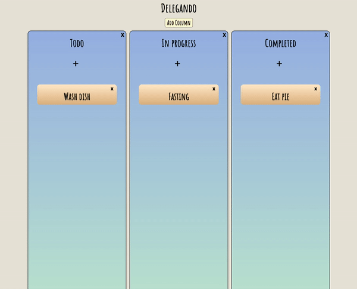

# Delegando

## [Live Link](https://stickmanbob.github.io/Delegando/)



## About

Delegando is a lightweight, virtual kanban board that runs in your bowser. All data is saved to your browser's local storage, so there are no accounts or server lag. It is purely a client side application.

Delegando was built in three days during the Mintbean.io Javascript Olympics Hackathon by Ajay Rajamani, Daniel Yee, and Daniel Chau. We hope you enjoy using Delegando!

## Implementation

The app was built using React and Redux. Under the contraints of the hackathon, no data could be stored on a back end database of any kind. In order to persist user data, we utilized Redux as a de-facto front end "database", and saved the contents of the redux store to local storage at every update.

``` Javascript
	//App.jsx, updates on every Redux state change

	class App extends React.Component {

		// App is a connected component with prop "state" that contains the entire redux store

		save() {
			let storage = window.localStorage;
			
			//Don't save the store to disk when it is initializing and empty
			if (this.props.state) {
				let data = JSON.stringify(this.props.state);
				storage.setItem("data", data);
			}
			
		}

		render() {

			//Save the contents of the redux store to disk on every re-render
			this.save();
		
	///...
```
Local storage data is then loaded as pre-loaded state into Redux on startup.

``` javascript
	// index.js
	
	// ...

	// Initialize state
	let storage = window.localStorage;
	let state = JSON.parse(storage.getItem('data'));

	//Create a Redux store with the preloaded state
	let store = configureStore(state);

	//Render the App

	ReactDOM.render(
    <React.StrictMode>
			<Provider store={store}>
      	<App />
			</Provider>
    </React.StrictMode>,
    document.getElementById("root")
  );
	
	// ...

```

If you wish to clear your local board data, simply run ``` localStorage.data = null ``` in the developer console.

In order to give objects (boards, columns, and notes) unique object id's, we stored a ```nextId ``` key in each slice of Redux state. That key is accessed whenever a new object of that type is created and then incremented in a Redux action. 

``` javascript
	//Sample Redux state:
		entities:{
			boards: {1: {…}, nextId: 2}
			columns:{
				1: {title: "To Do", notes: Array(0), id: 1}
				2: {title: "In Progress", notes: Array(0), id: 2}
				3: {title: "Done", notes: Array(0), id: 3}
				4: {title: "Staged", notes: Array(0), id: 4},
				nextId: 5
			}
	//...
		
	//Notice the use of "nextId" keys to denote the next availible object Id

	//Whenever a new object is created, that key is accessed by the associated reducer

		//columnsReducer.js

		export default function columnsReducer(state = {}, action) {
			
			Object.freeze(state);
			let column;
			let newColumn; 
			let newState; 
			
			switch (action.type) {
				case CREATE_COLUMN:
					// First, let's get the next availible object id
					let id = state.nextId;

					// create our new column object
					column = Object.assign({}, action.column, { id: id });

					//Duplicate the current state and add our new column object
					return Object.assign(
						{},

						state,

						{ [id]: column }, // Our new object, namespaced under its new id

						{ nextId: id + 1 } //Increment the next availible id by 1
					); 
				
		// ...

```